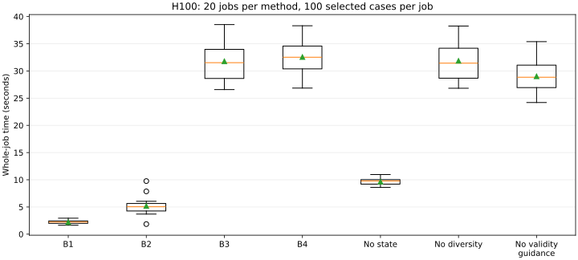

# Fixed-work H100 campaign result — 10 October 2026

All **140 successive jobs × 100 selected cases** completed and passed independent raw-case recomputation: **11,623 PASS**, **2,377 INVALID_TEST**, and **zero FAIL, unsupported or infrastructure failures**. Invalid selected cases consumed quota and were rejected before CUDA.

This completes the frozen v0.3 bounded E4/E5 matrix, with 20 paired independent blocks and seven methods. The statistical unit is a paired block; the 14,000 selected cases and 164,000 candidate draws are not independent statistical replicates. Development pilots and Kind CPU qualification are excluded. Fixed selected quotas do not equalize candidate-generation cost, valid CUDA executions, byte volume or wall time.

| Method | Jobs | PASS | INVALID_TEST | Candidate draws | Mean job (s) | Total jobs (min) |
|---|---:|---:|---:|---:|---:|---:|
| B1 | 20 | 1710 | 290 | 2000 | 2.205 | 0.735 |
| B2 | 20 | 1692 | 308 | 2000 | 5.180 | 1.727 |
| B3 | 20 | 2000 | 0 | 32000 | 31.780 | 10.593 |
| B4 | 20 | 2000 | 0 | 32000 | 32.566 | 10.855 |
| A_NO_STATE | 20 | 2000 | 0 | 32000 | 9.651 | 3.217 |
| A_NO_DIVERSITY | 20 | 2000 | 0 | 32000 | 31.863 | 10.621 |
| A_NO_VALIDITY_GUIDANCE | 20 | 221 | 1779 | 32000 | 29.019 | 9.673 |

The sum of whole-job intervals is **47.422 minutes**; the campaign interval is 47.483 minutes. Current start request to confirmed deallocation is **56.334 minutes**. Including the failed zero-work startup, cumulative conservative VM duration is **59.322 minutes**, within the approved 90-minute allowance. These measured intervals do not establish actual billing start or invoice charges.

The H100 is deallocated; the same VM, OS disk and thirteen managed resources remain. Independent CPU review took 26.642 minutes after deallocation. It required no additional H100 execution.

Zero candidate failures means zero confirmed defects in this bounded study. It does not prove defect absence, absolute hardware correctness, adequate statistical power or superiority of B4. The predeclared paired bootstrap uses 5,000 block resamples and seed 59001; primary detection comparisons use exact paired McNemar tests and Holm adjustment. With no detected defects in any method, each primary detection p-value and its adjustment are 1. All-zero primary outcomes yield degenerate bootstrap differences; this does not establish equivalence or adequate power. Nondetection times remain null and right-censored, never zero seconds. Software coverage and timing are secondary descriptive outcomes.

The independent host review passed the pinned kernel/driver, CC production, Secure Boot, CPU MAA RS256 signature/VM claims, CUDA references and the 96-case IR qualification. GPU hardware quote/remote-token authentication remains independently unverified; full E0–E8 is not complete.

The private original archive contains 597 hash-verified files and 2,896,869,059 compressed bytes. Its Azure copy was fully read back and matched SHA-256 and length; local originals remain preserved. Raw attestation tokens, credentials and case payloads are excluded from public Git.

[Result manifest](../../results/manifests/fixed-work-campaign-gpu-result.json) · [Method table](fixed-work-campaign-tables/methods.csv) · [140 job rows](fixed-work-campaign-tables/jobs.csv) · [Paired comparisons](fixed-work-campaign-tables/paired-comparisons.csv) · [Offline reproduction](../reproducibility/fixed-work-offline-audit.md) · [Remaining H100 work](remaining-h100-experiments.md)
